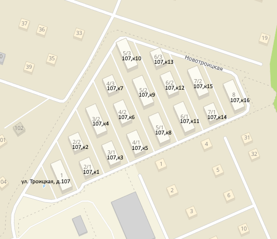
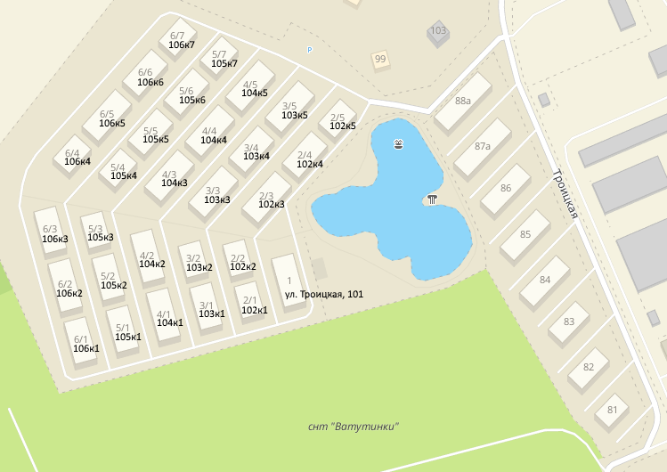

# Прудной и Новотроицкой официально нет

Уважаемые Cоседи!

Возможно вы знаете, а возможно и нет, но единственная официальная улица в поселке Рависсант - это Троицкая улица, а улицы Прудная и Новотроицкая - **неофициальные и фактически не существуют**:

Известные нам наименования наших улиц придумал Застройщик АО Керамо и использовал их как строительные адреса (адресный ориентир). С этими строительными адресами Росреестр поставил на кадастровый учет наши дома и квартиры. Вести адресный учет - не функция Росреестра, что принесли в документах - то и попало свидетельство о собственности и в единый государственный реестр недвижимости (ЕГРН).
> Вот такой адрес можно встретить в записях ЕГРН - "г. Москва, д.Пучково, на краю деревни, между двух полей, рядом с лесом, в овраге" (77:18:0191401:96)

Обязанность же ведения единого адресного реестра возложены на Федеральную Налоговую Службу (ФНС), реестр называется [ФИАС](http://fias.nalog.ru), ранее был КЛАДР. Изменения в адресный реестр вносятся на основе распоряжений Департамента Городского Имущества г. Москвы и дальше разносятся по государственным системам - Налоговая, Росреестр, Госуслуги и т.п.

Исторически так сложилось, что почтальон, который носит почту в д.Пучково, стал носить и по нашим адресам. Для отправки и приема писем важен только Индекс, который является номером отделения Почты-России, дальше придя в отделение уже почтальон  смотрит на адрес письма\посылки. Иными словами, там легко может быть написано - "на деревню бабушке Нюре" и почтальон либо найдет эту бабушку, либо оставит в отделении до востребования. Похожая ситуация с Яндекс.Карты, 2ГИС и т.п., данные в эти сервисы попадают не только из официальных источников и в случаях когда официальных данных нет то они вносятся руками пользователей(сообществом) как исторически сложившиеся ориентиры.

Возможно, Вам приходилось сталкиваться с тем, что на некоторых сервисах (особенно государственных сайтах) не всегда удается выбрать улицу из выпадающего списка - там наших улиц нет, либо улица есть, но нету дома. Это связано с тем, что все государственные информационные системы берут адреса их единого адресного реестра (ФИАС).

После неоднократных обращений жителей поселка Раввисант в местную Администрацию, Префектуру ТиНАО, Департамент Городского Имущества(ДГИ) и писем Мэру - со стороны данных организацией пошли некоторые подвижки по наведению порядка с документами по нашему поселку.

**Неприятная новость** заключается в том, что Департамент Городского Имущества г.Москвы решил не регистрировать улицы Прудная и Новотроицкая в д.Пучково, а "привязать" все наши дома к существующей ул.Троицкая.

Более того, Департамент Городского Имущества г.Москвы инициировал процесс по наведению порядка, и скоро вычистит старые упоминания:

На текущий момент, с ФИАС ситуация следующая:

* Дома на ул. Прудная уже присутствуют как дома на ул. Троицкая (100+старый номер дома) (Распоряжение ДГИ № 17265 от 14.06.2017), но при этом получение официального адреса квартире должен инициировать непосредственно **собственник квартиры**.

* Дома на ул. Новотроицкая отсутствуют даже в виде ул.Троицкая т.к. в Росреестре нет привязки домов к земле(это отдельная проблема) и где расположены дома никому не понятно, они находятся как бы в «воздухе» - отдельно от земли), что не позволяет массово присвоить официальный адрес всем домам. Адреса домам выдаются в ручном режиме по заявке собственника квартиры, выезжает сотрудник БТИ и фиксирует наличие дома на местности. Адреса домам выдаются как ул. Троицкая д.107 и остальные 17 домов как корпуса данного дома. В рамках первой заявки от дома - выдается адрес дому и квартире заявившему, последующие жители данного дома уже идут по стандартной схеме как жители ул. Прудная и получают адреса только на квартиру

Ниже на странице предлагается инструкция и вся необходимая информация по оформлению официального адреса для жителей ул. Прудной и ул. Новотроцкой. Несколько жителей уже успешно получили официальные адреса для своих квартир и домов.

## Новые адреса домов на карте

### 3-я очередь

### 4-я очередь

## Список адресов и кадастровых номеров

|Кадастровый номер|Старый адрес|Новый адрес|Адрес дома получен ?|
|-----------------|------------|-----------|--------------------|
|77:18:0191401:7|ул. Новотроицкая, д.1|ул. Троицкая, д. 107|[Да, №7464](<https://dgi-2-trp.mos.ru/DgiDocReestr2/DocumentsHandler.ashx/DownloadFile?id=54609485>)|
|77:18:0191401:8|ул. Новотроицкая, д.2к1|ул. Троицкая, д. 107к1||
|77:18:0191401:9|ул. Новотроицкая, д.2к2|ул. Троицкая, д. 107к2||
|77:18:0191401:10|ул. Новотроицкая, д.3к1|ул. Троицкая, д. 107к3|Да, №16801|
|77:18:0191401:14|ул. Новотроицкая, д.3к2|ул. Троицкая, д. 107к4|Да, №16801|
|77:18:0191401:15|ул. Новотроицкая, д.4к1|ул. Троицкая, д. 107к5|[Да, №10588](<https://dgi-2-trp.mos.ru/DgiDocReestr2/DocumentsHandler.ashx/DownloadFile?id=55360034>)|
|77:18:0191401:16|ул. Новотроицкая, д.4к2|ул. Троицкая, д. 107к6|[Да, №10588](<https://dgi-2-trp.mos.ru/DgiDocReestr2/DocumentsHandler.ashx/DownloadFile?id=55360034>)|
|77:18:0191401:17|ул. Новотроицкая, д.4к3|ул. Троицкая, д. 107к7||
|77:18:0191401:18|ул. Новотроицкая, д.5к1|ул. Троицкая, д. 107к8||
|77:18:0191401:19|ул. Новотроицкая, д.5к2|ул. Троицкая, д. 107к9|Да, №16801|
|77:18:0191401:20|ул. Новотроицкая, д.5к3|ул. Троицкая, д. 107к10||
|77:18:0191401:21|ул. Новотроицкая, д.6к1|ул. Троицкая, д. 107к11||
|77:18:0191401:22|ул. Новотроицкая, д.6к2|ул. Троицкая, д. 107к12||
|77:18:0191401:23|ул. Новотроицкая, д.6к3|ул. Троицкая, д. 107к13||
|77:18:0191401:24|ул. Новотроицкая, д.7к1|ул. Троицкая, д. 107к14||
|77:18:0191401:25|ул. Новотроицкая, д.7к2|ул. Троицкая, д. 107к15||
|77:18:0191401:26|ул. Новотроицкая, д.8|ул. Троицкая, д. 107к16||
|77:18:0191408:268|Прудная д.1|Троицкая д.101|[Да, №17265](<https://dgi-2-trp.mos.ru/DgiDocReestr2/DocumentsHandler.ashx/DownloadFile?id=22769448>)|
|77:18:0191408:254|Прудная д.2к1|Троицкая д.102к1|[Да, №17265](<https://dgi-2-trp.mos.ru/DgiDocReestr2/DocumentsHandler.ashx/DownloadFile?id=22769448>)|
|77:18:0191408:261|Прудная д.2к2|Троицкая д.102к2|[Да, №17265](<https://dgi-2-trp.mos.ru/DgiDocReestr2/DocumentsHandler.ashx/DownloadFile?id=22769448>)|
|77:18:0191408:64|Прудная д.2к3|Троицкая д.102к3|[Да, №17265](<https://dgi-2-trp.mos.ru/DgiDocReestr2/DocumentsHandler.ashx/DownloadFile?id=22769448>)|
|77:18:0191408:154|Прудная д.2к4|Троицкая д.102к4|[Да, №17265](<https://dgi-2-trp.mos.ru/DgiDocReestr2/DocumentsHandler.ashx/DownloadFile?id=22769448>)|
|77:18:0191408:178|Прудная д.2к5|Троицкая д.102к5|[Да, №17265](<https://dgi-2-trp.mos.ru/DgiDocReestr2/DocumentsHandler.ashx/DownloadFile?id=22769448>)|
|77:18:0191408:246|Прудная д.3к1|Троицкая д.103к1|[Да, №17265](<https://dgi-2-trp.mos.ru/DgiDocReestr2/DocumentsHandler.ashx/DownloadFile?id=22769448>)|
|77:18:0191408:75|Прудная д.3к2|Троицкая д.103к2|[Да, №17265](<https://dgi-2-trp.mos.ru/DgiDocReestr2/DocumentsHandler.ashx/DownloadFile?id=22769448>)|
|77:18:0191408:216|Прудная д.3к3|Троицкая д.103к3|[Да, №17265](<https://dgi-2-trp.mos.ru/DgiDocReestr2/DocumentsHandler.ashx/DownloadFile?id=22769448>)|
|77:18:0191408:46|Прудная д.3к4|Троицкая д.103к4|[Да, №17265](<https://dgi-2-trp.mos.ru/DgiDocReestr2/DocumentsHandler.ashx/DownloadFile?id=22769448>)|
|77:18:0191408:195|Прудная д.3к5|Троицкая д.103к5|[Да, №17265](<https://dgi-2-trp.mos.ru/DgiDocReestr2/DocumentsHandler.ashx/DownloadFile?id=22769448>)|
|77:18:0191408:125|Прудная д.4к1|Троицкая д.104к1|[Да, №17265](<https://dgi-2-trp.mos.ru/DgiDocReestr2/DocumentsHandler.ashx/DownloadFile?id=22769448>)|
|77:18:0191408:226|Прудная д.4к2|Троицкая д.104к2|[Да, №17265](<https://dgi-2-trp.mos.ru/DgiDocReestr2/DocumentsHandler.ashx/DownloadFile?id=22769448>)|
|77:18:0191408:185|Прудная д.4к3|Троицкая д.104к3|[Да, №17265](<https://dgi-2-trp.mos.ru/DgiDocReestr2/DocumentsHandler.ashx/DownloadFile?id=22769448>)|
|77:18:0191408:136|Прудная д.4к4|Троицкая д.104к4|[Да, №17265](<https://dgi-2-trp.mos.ru/DgiDocReestr2/DocumentsHandler.ashx/DownloadFile?id=22769448>)|
|77:18:0191408:205|Прудная д.4к5|Троицкая д.104к5|[Да, №17265](<https://dgi-2-trp.mos.ru/DgiDocReestr2/DocumentsHandler.ashx/DownloadFile?id=22769448>)|
|77:18:0191408:90|Прудная д.5к1|Троицкая д.105к1|[Да, №17265](<https://dgi-2-trp.mos.ru/DgiDocReestr2/DocumentsHandler.ashx/DownloadFile?id=22769448>)|
|77:18:0191408:55|Прудная д.5к2|Троицкая д.105к2|[Да, №17265](<https://dgi-2-trp.mos.ru/DgiDocReestr2/DocumentsHandler.ashx/DownloadFile?id=22769448>)|
|77:18:0191408:1|Прудная д.5к3|Троицкая д.105к3|[Да, №17265](<https://dgi-2-trp.mos.ru/DgiDocReestr2/DocumentsHandler.ashx/DownloadFile?id=22769448>)|
|77:18:0191408:118|Прудная д.5к4|Троицкая д.105к4|[Да, №17265](<https://dgi-2-trp.mos.ru/DgiDocReestr2/DocumentsHandler.ashx/DownloadFile?id=22769448>)|
|77:18:0191408:237|Прудная д.5к5|Троицкая д.105к5|[Да, №17265](<https://dgi-2-trp.mos.ru/DgiDocReestr2/DocumentsHandler.ashx/DownloadFile?id=22769448>)|
|77:18:0191408:8|Прудная д.5к6|Троицкая д.105к6|[Да, №17265](<https://dgi-2-trp.mos.ru/DgiDocReestr2/DocumentsHandler.ashx/DownloadFile?id=22769448>)|
|77:18:0191408:17|Прудная д.5к7|Троицкая д.105к7|[Да, №17265](<https://dgi-2-trp.mos.ru/DgiDocReestr2/DocumentsHandler.ashx/DownloadFile?id=22769448>)|
|77:18:0191408:99|Прудная д.6к1|Троицкая д.106к1|[Да, №17265](<https://dgi-2-trp.mos.ru/DgiDocReestr2/DocumentsHandler.ashx/DownloadFile?id=22769448>)|
|77:18:0191408:35|Прудная д.6к2|Троицкая д.106к2|[Да, №17265](<https://dgi-2-trp.mos.ru/DgiDocReestr2/DocumentsHandler.ashx/DownloadFile?id=22769448>)|
|77:18:0191408:170|Прудная д.6к3|Троицкая д.106к3|[Да, №17265](<https://dgi-2-trp.mos.ru/DgiDocReestr2/DocumentsHandler.ashx/DownloadFile?id=22769448>)|
|77:18:0191408:147|Прудная д.6к4|Троицкая д.106к4|[Да, №17265](<https://dgi-2-trp.mos.ru/DgiDocReestr2/DocumentsHandler.ashx/DownloadFile?id=22769448>)|
|77:18:0191408:24|Прудная д.6к5|Троицкая д.106к5|[Да, №17265](<https://dgi-2-trp.mos.ru/DgiDocReestr2/DocumentsHandler.ashx/DownloadFile?id=22769448>)|
|77:18:0191408:81|Прудная д.6к6|Троицкая д.106к6|[Да, №17265](<https://dgi-2-trp.mos.ru/DgiDocReestr2/DocumentsHandler.ashx/DownloadFile?id=22769448>)|
|77:18:0191408:163|Прудная д.6к7|Троицкая д.106к7|[Да, №17265](<https://dgi-2-trp.mos.ru/DgiDocReestr2/DocumentsHandler.ashx/DownloadFile?id=22769448>)|

### Земельные участки

| Кадастровый номер | Назначение |
| ----------------- | ---------- |
| 50:26:0191405:219 | Земельный участок 3-й очереди |
| 50:26:0191408:1 | Земельный участок 4-й очереди |

## Что делать и как жить

**Собственникам квартир с ул. Прудная и частично с ул.Новотроицкая**, где дома уже **получили** новые официальные адреса - **необходимо запросить официальный адрес для своей квартиры** и Департамент Городского Имущества г.Москвы выпустит распоряжение о присвоении адреса квартире в данном доме.

Присвоить адрес квартире в доме можно через Портал Госуслуг г. Москвы (ходить никуда не надо):

1. Зайти под своей учетной записью на сайт <https://my.mos.ru/my/>
2. Выбрать услугу ["Присвоение адреса объекту адресации"](<https://www.mos.ru/pgu/ru/application/dgi/054201/>)
3. На странице "_Шаг 1. Выбор услуги_" - выбрать "_Присвоение адреса объекту недвижимости – помещению_" и нажать _Продолжить_
4. Выбрать "_Образование помещения(ий) в здании, сооружении путем раздела здания, сооружения_" и нажать _Продолжить_
5. Паспортные данные автоматически подставятся, если они были указаны в профиле mos.ru
6. В разделе _Сведения об объекте недвижимости (здание, сооружение, объект незавершенного строительства)_
    * ОКАТО = город Москва
    * Тип номера = Кадастровый номер
    * Кадастровый номер = **Указать кадастровый номер дома**
    * Тип адреса = Адресный ориентир
    * Округ = Троицкий административный округ
    * Район = Поселение Первомайское
    * Адресный ориентир = **Адрес дома (новый или старый)**
    * Права на объект недвижимости зарегистрированы в Росреестре? = Да
    * Дата выдачи распорядительного документа об утверждении адреса объекта недвижимости = **Указать текущую дату**
    * Номер распорядительного документа об утверждении адреса объекта недвижимости = **Указать цифру 1**
7. В разделе _Сведения об объектах недвижимости (помещение)_
    * Назначение объекта недвижимости = Жилое
    * Вид жилого помещения = Квартира
    * ОКАТО = город Москва
    * Тип номера = Кадастровый номер
    * Тип адреса = Адресный ориентир
    * Округ = Троицкий административный округ
    * Район = Поселение Первомайское
    * Адресный ориентир = **Текущий адрес квартиры**
    * Права на объект недвижимости зарегистрированы в Росреестре? = Да
    * Дата выдачи распорядительного документа об утверждении адреса объекта недвижимости = **Указать текущую дату**
    * Номер распорядительного документа об утверждении адреса объекта недвижимости = **Указать цифру 1**
8. В разделе _Сведения о земельном участке_
    * Тип номера = Кадастровый номер
    * Кадастровый номер = **указать кадастровый номер земельного участка**
9. Хочу получить результат на бумажном носителе, направленный почтовым уведомлением = **по желанию**
10. Нажать кнопку "Отправить"
11. Дождаться положительного решения по услуге(до 30 дней) и получить Распоряжение ДГИ (в электронном или бумажном виде)
12. Поздравляем! У Вас теперь официальный адрес.
13. (Опционально) Если по прошествии месяца в Росреестр(ЕГРН) и ЛК Налоговой не изменится адрес у объекта, то им можно направить постановление ДГИ через форму обратной связи.

**Собственникам квартир с ул. Новотроицкая**, где дома еще **не получили** новые официальные адреса - необходимо приложить больше усилий и получить сначала адрес дома. Эта сложность связана с тем, что дома в 3й очереди не привязаны к земельному участку(нет на кадастровой карте) и сотрудники Департамента Городского Имущества г.Москвы не могут определить их местоположения. Для этого необходимо добиться того, чтобы на место выехал сотрудник МосгорБТИ и произвел фиксацию.
**Эта операция делается только 1 раз от дома, после чего все соседи действуют по схеме как для ул. Прудная (см. выше)**

Шаг №1 "Попытка не пытка"

1. Зайти под своей учетной записью на сайт <https://my.mos.ru/my/>
2. Выбрать услугу ["Присвоение адреса объекту адресации"](<https://www.mos.ru/pgu/ru/application/dgi/054201/>)
3. На странице "_Шаг 1. Выбор услуги_" - выбрать "_Присвоение адреса объекту недвижимости – зданию, сооружению, объекту незавершенного строительства_" и нажать _Продолжить_
4. Выбрать "_Строительство, реконструкция здания, сооружения_" и нажать _Продолжить_
5. Паспортные данные автоматически подставятся, если они были указаны в профиле mos.ru
6. В разделе _Сведения об объекте недвижимости (здание, сооружение, объект незавершенного строительства)_
    * Тип объекта недвижимости = Здание
    * Назначение объекта недвижимости = Жилое
    * ОКАТО = город Москва
    * Тип номера = Кадастровый номер
    * Кадастровый номер = **Указать кадастровый номер дома**
    * Тип адреса = Адресный ориентир
    * Округ = Троицкий административный округ
    * Район = Поселение Первомайское
    * Адресный ориентир = **Адрес дома (новый или старый)**
    * Права на объект недвижимости зарегистрированы в Росреестре? = Да
    * Дата выдачи распорядительного документа об утверждении адреса объекта недвижимости = **Указать текущую дату**
    * Номер распорядительного документа об утверждении адреса объекта недвижимости = **Указать цифру 1**
7. В разделе _Сведения об объектах недвижимости (помещение)_
    * Назначение объекта недвижимости = Жилое
    * Вид жилого помещения = Квартира
    * ОКАТО = город Москва
    * Тип номера = Кадастровый номер
    * Тип адреса = Адресный ориентир
    * Округ = Троицкий административный округ
    * Район = Поселение Первомайское
    * Адресный ориентир = **Текущий адрес квартиры**
    * Права на объект недвижимости зарегистрированы в Росреестре? = Да
    * Дата выдачи распорядительного документа об утверждении адреса объекта недвижимости = **Указать текущую дату**
    * Номер распорядительного документа об утверждении адреса объекта недвижимости = **Указать цифру 1**
8. В разделе _Сведения о земельном участке_
    * Тип номера = Кадастровый номер
    * Кадастровый номер = **указать кадастровый номер земельного участка**
9. Хочу получить результат на бумажном носителе, направленный почтовым уведомлением = **по желанию**
10. Нажать кнопку "Отправить"
11. Дождаться решения по услуге(до 30 дней)

Вероятнее всего придет отказ с формулировкой -
 Выписка из ЕГРН от 24.08.2018 № 77/ИСХ/18-2714928, полученная с использованием межведомственного информационного взаимодействия, не содержит сведений о принадлежности объекта адресации с кадастровым номером 77:18:0191401:** земельному участку с кадастровым номером 50:26:0191405:219 и схему расположения объекта адресации в границах земельного участка, соответственно,  Департамент не имеет возможности установить местоположение и конфигурацию объекта адресации.

Шаг 2. "Попытка №2"

1. Необходимо повторить в точности Шаг №1, кроме ожидания решения по услуге и перейти сразу к п.2
2. Через форму обратной связи на сайте mos.ru - (<https://www.mos.ru/feedback/individual/>)
3. Указав, "Получатель" = Департамент городского имущества города Москвы, написать обращение:
    * Персональные данные = **Ваши персональные данные**
    * Суть вопроса = Отказ с присвоением адреса
    * Содержание обращения = "Прошу разъяснить почему я получил отказ по услуге №**указать номер предыдущей заявки** т.к. у меня имеется информация, что в отношении моего дома такая техническая возможность есть, в связи с этим я создал новую заявку **указать номер новой заявки**, прошу направить на дополнительную проверку"
    * Код с картинки, Предварительный просмотр, Отправить

Шаг 3. "Личный звонок"

1. Новую заявку желательно подтолкнуть личным звонком Зам. Начальника службы Адресного Реестра ГБУ МосгорБТИ (Дмитрий Константинович Есипов)
2. Позвонить по номеру +74997481381 и сказать: "Здраствуйте, Я (такой-то) на портале Государственных услуг г. Москвы создал повторно заявку по присвоению адреса, т.к. моя прошлая заявка была отклонена. Хотя я знаю (соседи уже так сделали), что по моему дом такая техническая возможность есть. Прошу мою заявку **номер новой заявки** пометить, чтобы она не пошла на оператора, который по стандартному регламенту ее отклонит. Спасибо! "

Шаг 4. Ожидание

1. Новая заявка должна будет перейти в состояние "Присотановлена"
2. С Вами свяжется сотрудник МосгорБТИ и договорится о времени визита в поселок для фиксации местоположения дома. Скорее всего это будет Анна Николаевна (Живет в г.Троицк и может приехать даже в районе 20:00)
3. Дождаться Распоряжения о присвоении адреса дому и квартире. )
4. Поздравления

## F.A.Q

### Что делать после получения Распоряжения о присвоении адреса квартире

1. Дождаться пока адрес появится в ФИАС (<http://fias.nalog.ru>)
2. Дождаться пока адрес изменится в Росреестре (<https://rosreestr.ru/wps/portal/p/cc_ib_portal_services/online_request>)
3. Получить выписку ЕГРН с новым адресом в МФЦ
4. В паспортном столе сменить адрес прописки (на основании выписки ЕГРН)
5. Обновлять другие документы

### Что делать если после получения Распоряжения о присвоении адреса квартире и появления адреса в ФИАС - изменения в Росреестре не происходят

1. Убедиться, что прошло больше 2ух недель после появления адреса в ФИАС
2. Через форму обратной связи на сайте mos.ru - (<https://www.mos.ru/feedback/individual/>) написать обращение, указав, «Получатель» = Департамент городского имущества города Москвы, написать обращение: Моему объекту недвижимости(квартире) с кадастровым номером указать кадастровый номер квартиры в многоквартирном доме кадастровый номер дома был присвоен адрес. Прошу направить копии документов по квартире и дому в Управление Росреестра по г.Москве для актуализации информации
3. Через форму обращения на сайте Rosreestr.Ru - (<https://rosreestr.ru/wps/portal/p/cc_ib_support/cc_ib_references_citizens>) написать обращение - Объектам недвижимости (квартире) кадастровый номер квартиры распоряжением №номер распоряжения от дата распоряжения ДГИ г.Москвы присвоен адрес, прошу актуализировать информацию. (Если Вы получали еще и адрес дома, то сослаться и на кадастровый номер дома и распоряжения по дому)